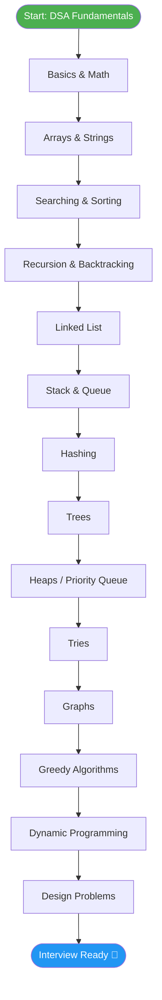
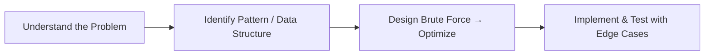

# 📊 DSA in Java

A structured, topic-wise collection of **Data Structures & Algorithms (DSA)** problems solved in **Java**, built while preparing for SDE interviews at product-based companies (Google, Amazon, Microsoft, etc.). This repository serves as both a **personal practice log** and a **revision reference** covering everything from basic arrays to advanced graph algorithms and dynamic programming.

---

## 🏷 Badges


---

## 📌 Table of Contents

- [About](#-about)
- [Why This Repository](#-why-this-repository)
- [Topics Covered](#-topics-covered)
- [Repository Structure](#-repository-structure)
- [Learning Roadmap (Flowchart)](#-learning-roadmap-flowchart)
- [Problem-Solving Approach](#-problem-solving-approach)
- [Time & Space Complexity Cheatsheet](#-time--space-complexity-cheatsheet)
- [Progress Tracker](#-progress-tracker)
- [How to Use This Repo](#-how-to-use-this-repo)
- [Resources & References](#-resources--references)
- [Connect With Me](#-connect-with-me)
- [License](#-license)

---

## 📖 About

This repository documents my journey through **Data Structures and Algorithms**, solved and organized topic-by-topic in **Java**. Each solution is written with:

- ✅ Clean, readable, and well-commented code
- ✅ Optimal time and space complexity (with brute-force alternatives noted where useful)
- ✅ Problem source links (LeetCode / GeeksforGeeks / Codeforces)
- ✅ A short explanation of the approach and intuition behind the solution

> 🎯 **Goal:** Build strong problem-solving fundamentals and be fully interview-ready for SDE-1/SDE-2 roles at top product-based companies.

---

## 🚀 Why This Repository

- 📚 Acts as a **single source of truth** for all my DSA practice instead of scattered submissions across platforms
- 🔁 Enables **quick revision** before interviews using topic-wise folders
- 🧠 Reinforces learning by re-explaining each solution in my own words
- 📈 Tracks consistency and progress over time

---

## 🗂 Topics Covered

| # | Topic | Key Concepts |
|---|---|---|
| 01 | **Basics & Math** | Number theory, bit manipulation, GCD/LCM, prime sieves |
| 02 | **Arrays** | Two pointers, sliding window, prefix sum, Kadane's algorithm |
| 03 | **Strings** | Pattern matching, palindromes, anagrams, KMP, Z-algorithm |
| 04 | **Searching & Sorting** | Binary search, merge sort, quick sort, counting sort |
| 05 | **Recursion & Backtracking** | Subsets, permutations, N-Queens, Sudoku solver |
| 06 | **Linked List** | Singly/doubly linked list, cycle detection, reversal, merge |
| 07 | **Stack & Queue** | Monotonic stack, min stack, circular queue, deque |
| 08 | **Trees** | Binary trees, BST, traversals (in/pre/post/level-order), diameter, LCA |
| 09 | **Heaps / Priority Queue** | Min-heap, max-heap, top-K problems, heap sort |
| 10 | **Graphs** | BFS, DFS, Dijkstra, Bellman-Ford, Union-Find, MST (Kruskal/Prim), topological sort |
| 11 | **Dynamic Programming** | Knapsack, LCS, LIS, DP on trees/grids, digit DP |
| 12 | **Greedy Algorithms** | Activity selection, interval scheduling, Huffman coding |
| 13 | **Tries** | Prefix trees, word search, autocomplete |
| 14 | **Sliding Window & Two Pointers** | Subarray/substring optimization problems |
| 15 | **Hashing** | HashMap/HashSet-based problems, frequency counting |
| 16 | **Design Problems** | LRU Cache, LFU Cache, custom data structure design |

---

## 📂 Repository Structure

```
DSA-in-java/
│
├── 01-Basics-Math/
│   ├── GCD_LCM.java
│   ├── SieveOfEratosthenes.java
│   └── BitManipulation.java
│
├── 02-Arrays/
│   ├── KadaneAlgorithm.java
│   ├── TwoPointerProblems.java
│   └── SlidingWindow.java
│
├── 03-Strings/
│   ├── KMPAlgorithm.java
│   └── PalindromeChecks.java
│
├── 04-Searching-Sorting/
│   ├── BinarySearch.java
│   ├── MergeSort.java
│   └── QuickSort.java
│
├── 05-Recursion-Backtracking/
│   ├── NQueens.java
│   └── Subsets.java
│
├── 06-LinkedList/
│   ├── SinglyLinkedList.java
│   └── CycleDetection.java
│
├── 07-Stack-Queue/
│   ├── MonotonicStack.java
│   └── MinStack.java
│
├── 08-Trees/
│   ├── BinaryTreeTraversals.java
│   └── LowestCommonAncestor.java
│
├── 09-Heaps/
│   └── TopKElements.java
│
├── 10-Graphs/
│   ├── DijkstraAlgorithm.java
│   ├── UnionFind.java
│   └── TopologicalSort.java
│
├── 11-DynamicProgramming/
│   ├── ZeroOneKnapsack.java
│   └── LongestCommonSubsequence.java
│
├── 12-Greedy/
│   └── ActivitySelection.java
│
├── 13-Tries/
│   └── TrieImplementation.java
│
├── 14-Hashing/
│   └── FrequencyCounter.java
│
├── 15-Design/
│   └── LRUCache.java
│
└── README.md
```

> 📁 Each folder is self-contained — every `.java` file includes the problem statement (as a comment), the approach used, and time/space complexity at the top of the file.

---

## 🧭 Learning Roadmap (Flowchart)

The diagram below shows the recommended order for tackling topics in this repo — from fundamentals to advanced algorithms.



---

## 🧩 Problem-Solving Approach

Every solution in this repo follows a consistent 4-step template:



1. **Understand** — Re-state the problem, identify constraints and edge cases.
2. **Pattern Recognition** — Map the problem to a known pattern (e.g., sliding window, two pointers, DFS/BFS, DP).
3. **Design** — Start with a brute-force approach, then optimize for time/space.
4. **Implement & Verify** — Write clean Java code, test against edge cases (empty input, single element, duplicates, large inputs).

---

## ⏱ Time & Space Complexity Cheatsheet

| Data Structure / Algorithm | Best | Average | Worst | Space |
|---|---|---|---|---|
| Array Access | O(1) | O(1) | O(1) | O(n) |
| Binary Search | O(1) | O(log n) | O(log n) | O(1) |
| Merge Sort | O(n log n) | O(n log n) | O(n log n) | O(n) |
| Quick Sort | O(n log n) | O(n log n) | O(n²) | O(log n) |
| Linked List Search | O(1) | O(n) | O(n) | O(n) |
| BST Search/Insert | O(log n) | O(log n) | O(n) | O(n) |
| Heap Insert/Extract | O(1)/O(log n) | O(log n) | O(log n) | O(n) |
| BFS / DFS | O(V + E) | O(V + E) | O(V + E) | O(V) |
| Dijkstra (Min-Heap) | O(E log V) | O(E log V) | O(E log V) | O(V) |
| DP (typical 2D) | O(n·m) | O(n·m) | O(n·m) | O(n·m) or O(n) optimized |

---

## 📈 Progress Tracker

| Topic | Problems Solved | Status |
|---|---|---|
| Basics & Math | — | 🟡 In Progress |
| Arrays | — | 🟡 In Progress |
| Strings | — | ⚪ Not Started |
| Searching & Sorting | — | ⚪ Not Started |
| Recursion & Backtracking | — | ⚪ Not Started |
| Linked List | — | ⚪ Not Started |
| Stack & Queue | — | ⚪ Not Started |
| Trees | — | ⚪ Not Started |
| Heaps | — | ⚪ Not Started |
| Graphs | — | ⚪ Not Started |
| Dynamic Programming | — | ⚪ Not Started |
| Greedy | — | ⚪ Not Started |
| Tries | — | ⚪ Not Started |
| Hashing | — | ⚪ Not Started |
| Design Problems | — | ⚪ Not Started |

> 🔄 Update this table as you push new solutions — it's a great motivator and gives recruiters/visitors a quick view of your consistency.

---

## 🧑‍💻 How to Use This Repo

### Clone the repository
```bash
git clone https://github.com/soumen827/DSA-in-java.git
cd DSA-in-java
```

### Compile and run any solution
```bash
cd 08-Trees
javac BinaryTreeTraversals.java
java BinaryTreeTraversals
```

### Suggested workflow
1. Pick a topic folder in the order shown in the [roadmap](#-learning-roadmap-flowchart)
2. Read the problem statement in the comment header of each file
3. Try solving it yourself before checking the implementation
4. Compare your approach's complexity with the one documented

---

## 📚 Resources & References

- [LeetCode](https://leetcode.com/) — Primary practice platform
- [GeeksforGeeks](https://www.geeksforgeeks.org/) — Concept explanations
- [NeetCode Roadmap](https://neetcode.io/) — Pattern-based problem grouping
- [Striver's SDE Sheet](https://takeuforward.org/) — Interview-focused problem set

---

## 🔗 Connect With Me

- **GitHub:** [soumen827](https://github.com/soumen827)
- **LeetCode:** [Soumen827](https://leetcode.com/u/Soumen827/)
- **LinkedIn:** [soumen-laha](https://www.linkedin.com/in/soumen-laha-2a350033a/)
- **Email:** laha9566@gmail.com

---

## 📄 License

This repository is licensed under the **MIT License**. Feel free to use these solutions for learning and reference purposes.

---

### ⭐ If this repository helped you in your DSA journey, consider giving it a star!
